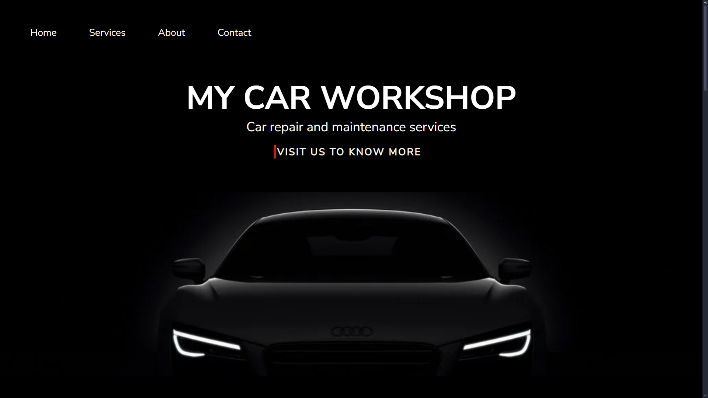
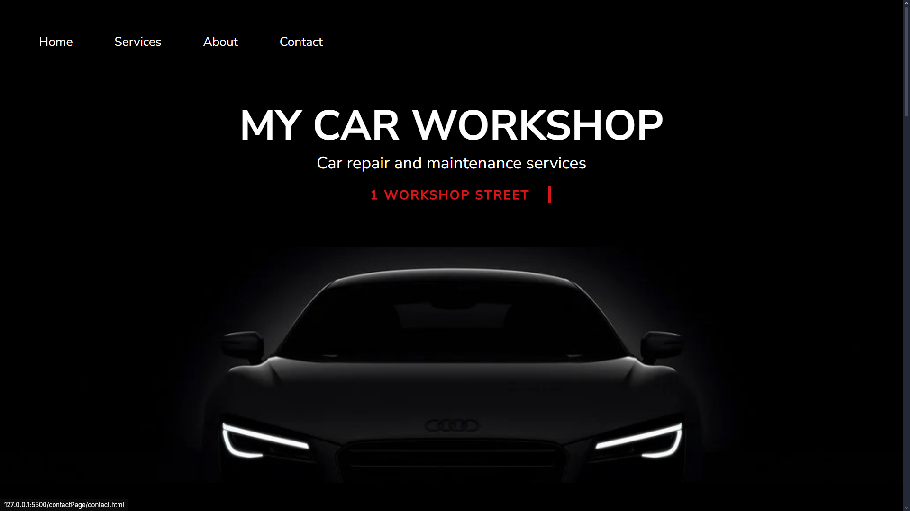
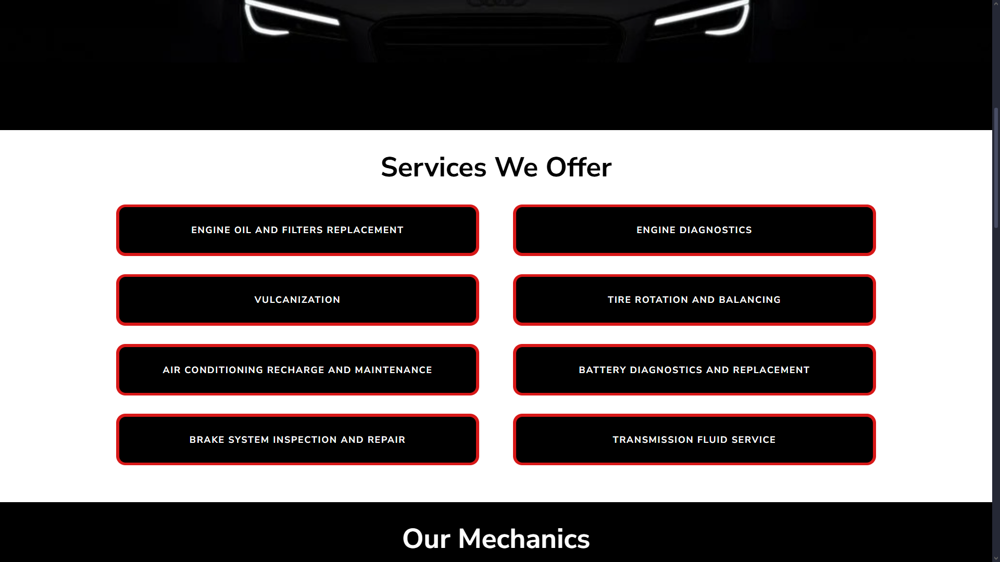
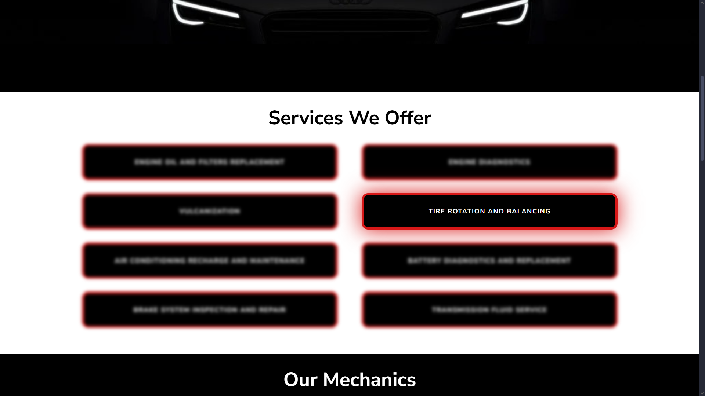
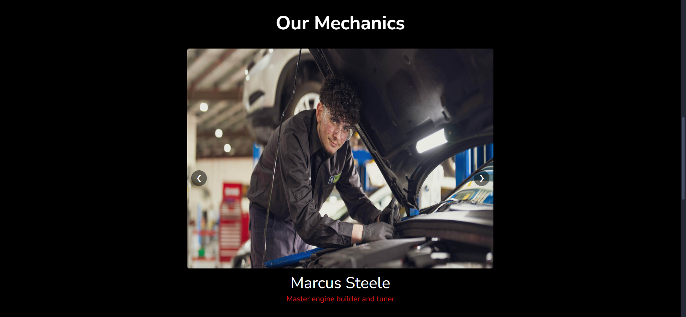
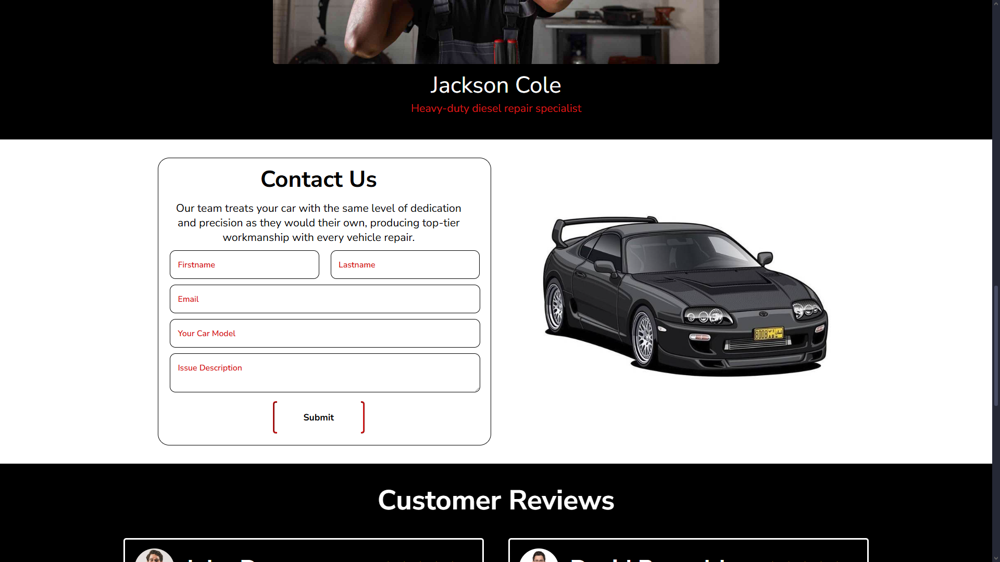
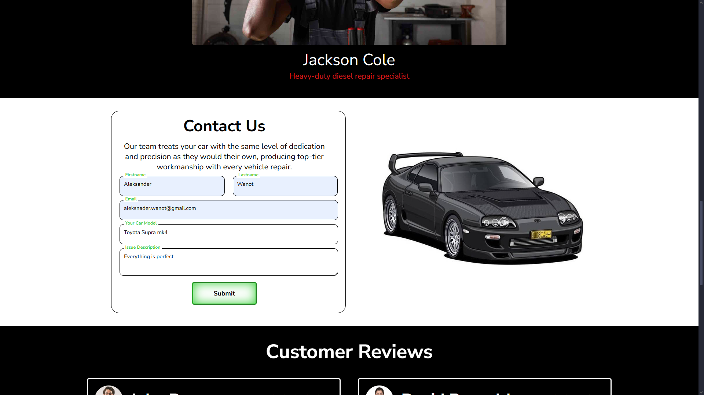
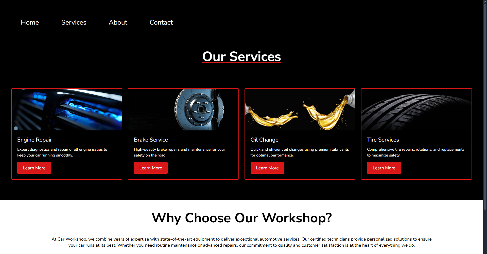
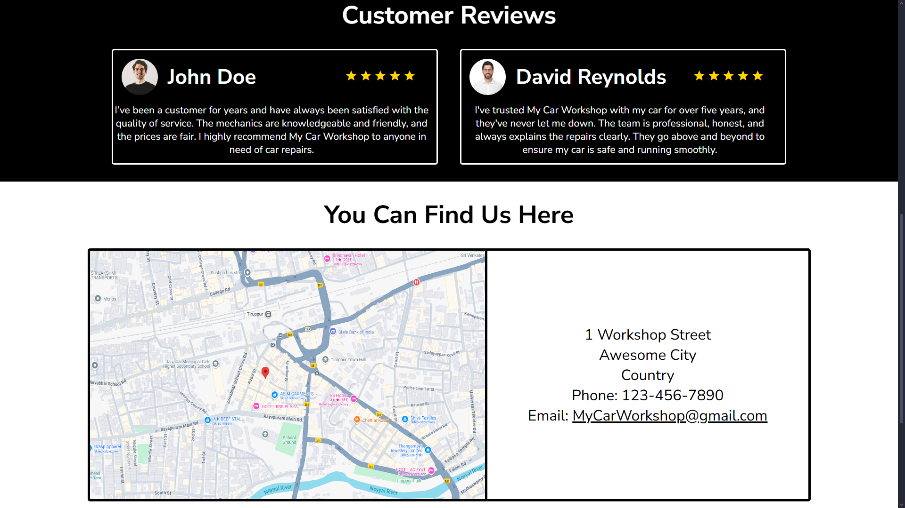

# My Car Workshop

My Car Workshop is a personal project designed to showcase the fundamentals of **HTML**, **CSS**, and **JavaScript**. This project demonstrates the creation of a responsive and interactive website for a fictional car workshop, featuring modern web design techniques and functionality.

---

## 🚀 Features

- **Dynamic Content**: JavaScript-powered content updates for seamless user interaction.
- **Modern Styling**: Clean and professional design using CSS.
- **Multi-Page Layout**: Includes pages for Home, Services, About, and Contact.

---

## 📂 Project Structure

```
My-Car-Workshop/
│
├── indexPage/
│   ├── index.html
│   ├── indexStyle.css
│   ├── indexScript.js
│
├── aboutPage/
│   ├── about.html
│   ├── aboutStyle.css
│   ├── aboutScript.js
│
├── servicesPage/
│   ├── services.html
│   ├── servicesStyle.css
│
├── contactPage/
│   ├── contact.html
│   ├── contactStyle.css
│
├── images/                 # Image assets
├── screenshots/            # Screenshots of the project
│   ├── home-page.png
│   ├── about-page.png
│   ├── services-page.png
│   ├── contact-page.png
│
├── colors.css              # Shared color variables
├── README.md               # Project documentation
└── LICENSE                 # License file
```

---

## 🛠️ Technologies Used

- **HTML5**: For semantic and structured content.
- **CSS3**: For styling, including responsive design.
- **JavaScript**: For interactivity and dynamic content updates.
- **Google Fonts**: For modern typography.
- **Material Icons**: For intuitive icons.

---

## 🌟 Key Functionalities

1. **Home Page**:
   - A welcoming banner with a call-to-action button.
   - Navigation links to other pages.

2. **About Page**:
   - Dynamic content updates using JavaScript.
   - Detailed information about the workshop.

3. **Services Page**:
   - A list of services offered by the workshop.

4. **Contact Page**:
   - A form for users to submit inquiries.
   - Clickable email and phone links.

---

## 📸 Screenshots

### Home Page
<table>
  <tr height="150px">
    <td></td>
    <td></td>
  </tr>
    <tr>
    <td></td>
    <td></td>
  </tr>
    <tr>
    <td></td>
    <td></td>
  </tr>
    <tr>
    <td></td>
    <td></td>
  </tr>
</table>

### About Page
<table>
  <tr>
    <td></td>
    <td></td>
  </tr>
</table>

### Services Page


### Contact Page


---

## ⚙️ Installation and Usage

1. Clone the repository:
   ```bash
   git clone https://github.com/your-username/My-Car-Workshop.git
2. Open the index.html file in your browser to view the website.

---

## 🤝 Contributing
Contributions are welcome! If you have suggestions or improvements, feel free to fork the repository and submit a pull request.

---

## 📜 License
This project is under the MIT License - see the [LICENSE](./LICENSE) file for details.